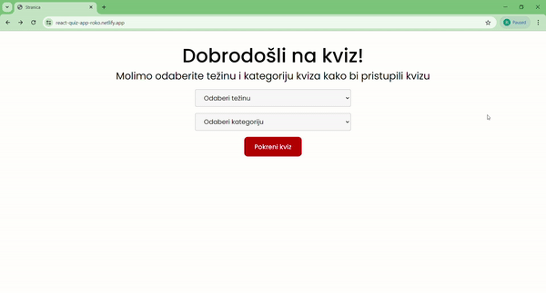

# React Quiz App



[Video of how it works](https://drive.google.com/file/d/1enGtmcRHALDfmspq1UC8lOLgw26doECR/view?usp=sharing)

Welcome to the Quiz App, where you need to choose a category and quiz level to get started with a quiz. You need to answer ten questions with four answers and after the 10th question, you get a result page with several correctly answered questions and a list of questions with their answers. Questions from the chosen category with their answers are from [Trivia API](https://opentdb.com/api_config.php). 

## Live demo

You can view the live demo of the project [here](https://react-quiz-app-roko.netlify.app/).

## Summary

For this project, I utilized a React template that I created, incorporating a well-organized SCSS structure where each component has its folder.

**Design and Styling**

I defined typography and the main font which is [Poppins](https://fonts.google.com/specimen/Poppins?query=poppins) from [Google fonts](https://fonts.google.com/).

**TypeScript Integration**

I created TypeScript types for the data used in the components.

**Challenges and Solutions**

The most challenging part of the project was implementing API and configuring [React Router](https://reactrouter.com/en/main). I chose the [Trivia API](https://opentdb.com/api_config.php) for its variety of categories, difficulty levels, and question types (true/false or multiple choice).  Configuring React Router turned out to be simpler than expected, allowing me to define and implement routes efficiently. I'm proud of the project's structure. I created functions to fetch categories and quiz data based on the selected category and difficulty level. I organized them in a folder and invoked them in components.


## Project Structure
- **Folders and Files:** The project follows modular structure for folder with components, pages, library and utilities
- **Technologies Used:** React.js, SCSS, TypeScript, React Router
- **Trivia API:** Questions and answers are managed via the Trivia API, an online service providing trivia across various categories and difficulty levels
- **Considerations:** The main focus for this project is to understand how to implement API and make everything optimized with good types of data

## Time Spent

I need 20-25 hours of work to make this project.
## How to Use

Make sure you have the following installed on your computer:

- [git](https://git-scm.com/)
- [node.js](https://nodejs.org/en)
- [npm](https://www.npmjs.com/)

Clone the repository

```bash
git clone https://github.com/Roko03/react-quiz-app.git
cd react-quiz-app
```

Installation

```bash
npm i
#or
npm install
```

Running the Project

```bash
npm run dev
```

Open [http://localhost:3000](http://localhost:3000) to view the project
